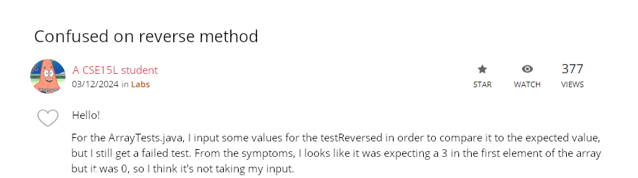
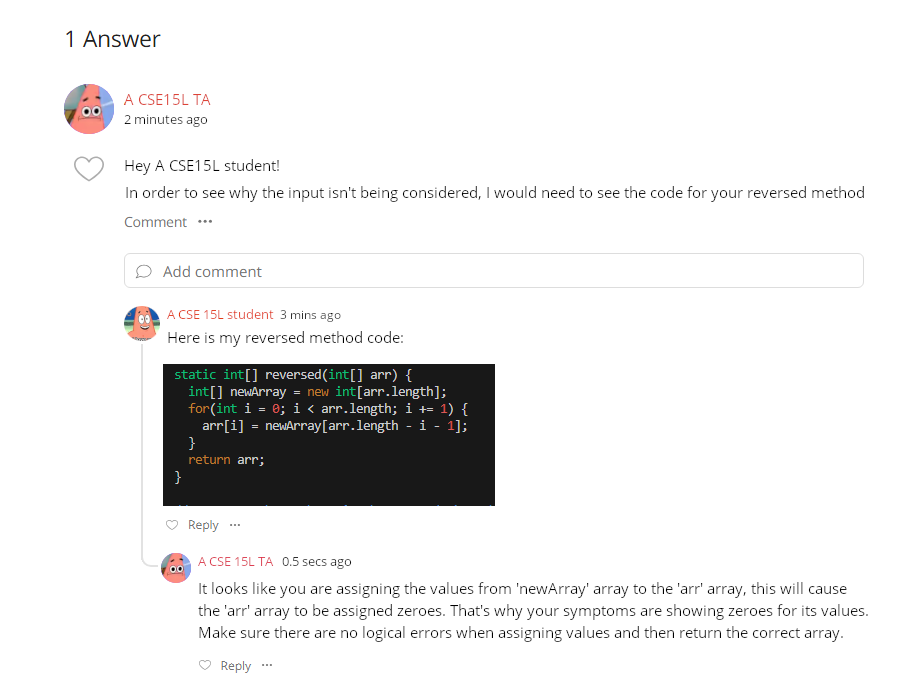

# CSE 15L - Lab Report 5 - Alexander Zhen

## Part 1 - Debugging Scenario

1. The original post from a student with a screenshot showing a symptom and a description of a guess at the bug/some sense of what the failure-inducing input is.



> In this scenario, this student stated that their input for their testReversed failed when inputting their values/expected values and then stated that their input wasn't being entered due to the symptoms they received. They provided their `ArrayTests.java` and the symptoms of running their test script.

ArrayTests.java
```
...
  @Test
  public void testReversed() {
    int[] input1 = {1,2,3};
    assertArrayEquals(new int[]{3,2,1}, ArrayExamples.reversed(input1));
  }
}
```
Symptom
```
$ bash test.sh
JUnit version 4.13.2
..E
Time: 0.009
There was 1 failure:
1) testReversed(ArrayTests)
arrays first differed at element [0]; expected:<3> but was:<0>
        at org.junit.internal.ComparisonCriteria.arrayEquals(ComparisonCriteria.java:78)
        at org.junit.internal.ComparisonCriteria.arrayEquals(ComparisonCriteria.java:28)
        at org.junit.Assert.internalArrayEquals(Assert.java:534)
        at org.junit.Assert.assertArrayEquals(Assert.java:418)
        at org.junit.Assert.assertArrayEquals(Assert.java:429)
        at ArrayTests.testReversed(ArrayTests.java:18)
        ... 32 trimmed
Caused by: java.lang.AssertionError: expected:<3> but was:<0>
        at org.junit.Assert.fail(Assert.java:89)
        at org.junit.Assert.failNotEquals(Assert.java:835)
        at org.junit.Assert.assertEquals(Assert.java:120)
        at org.junit.Assert.assertEquals(Assert.java:146)
        at org.junit.internal.ExactComparisonCriteria.assertElementsEqual(ExactComparisonCriteria.java:8)
        at org.junit.internal.ComparisonCriteria.arrayEquals(ComparisonCriteria.java:76)
        ... 38 more

FAILURES!!!
Tests run: 2,  Failures: 1
```
---
2. A response from a TA asking a leading question or suggesting a command to try (To be clear, you are mimicking a TA here.)



> In this scenario,


Code provided:
```
static int[] reversed(int[] arr) {
    int[] newArray = new int[arr.length];
    for(int i = 0; i < arr.length; i += 1) {
      arr[i] = newArray[arr.length - i - 1];
    }
    return arr;
  }
```
