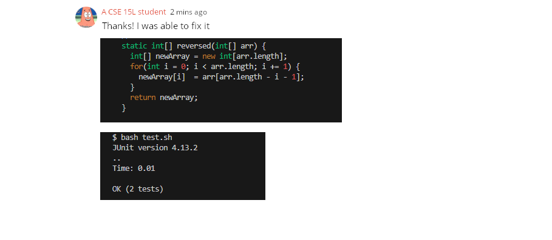

# CSE 15L - Lab Report 5 - Alexander Zhen

## Part 1 - Debugging Scenario

1. The original post from a student with a screenshot showing a symptom and a description of a guess at the bug/some sense of what the failure-inducing input is.


> In this scenario, this student stated that their input for their testReversed failed when inputting their values/expected values and then stated that their input wasn't being entered due to the symptoms they received. They provided their `ArrayTests.java` and the symptoms of running their test script.

Student provided:

ArrayTests.java

```
...
  @Test
  public void testReversed() {
    int[] input1 = {1,2,3};
    assertArrayEquals(new int[]{3,2,1}, ArrayExamples.reversed(input1));
  }
}
```

Symptom

```
$ bash test.sh
JUnit version 4.13.2
..E
Time: 0.009
There was 1 failure:
1) testReversed(ArrayTests)
arrays first differed at element [0]; expected:<3> but was:<0>
        at org.junit.internal.ComparisonCriteria.arrayEquals(ComparisonCriteria.java:78)
        at org.junit.internal.ComparisonCriteria.arrayEquals(ComparisonCriteria.java:28)
        at org.junit.Assert.internalArrayEquals(Assert.java:534)
        at org.junit.Assert.assertArrayEquals(Assert.java:418)
        at org.junit.Assert.assertArrayEquals(Assert.java:429)
        at ArrayTests.testReversed(ArrayTests.java:18)
        ... 32 trimmed
Caused by: java.lang.AssertionError: expected:<3> but was:<0>
        at org.junit.Assert.fail(Assert.java:89)
        at org.junit.Assert.failNotEquals(Assert.java:835)
        at org.junit.Assert.assertEquals(Assert.java:120)
        at org.junit.Assert.assertEquals(Assert.java:146)
        at org.junit.internal.ExactComparisonCriteria.assertElementsEqual(ExactComparisonCriteria.java:8)
        at org.junit.internal.ComparisonCriteria.arrayEquals(ComparisonCriteria.java:76)
        ... 38 more

FAILURES!!!
Tests run: 2,  Failures: 1
```

---

2. A response from a TA asking a leading question or suggesting a command to try (To be clear, you are mimicking a TA here.)


> In this scenario, we would ask for the code in order to fully understand the issue. It looks like the student had a logical error, where they assigned the values of `newArray` to `arr`, causing it to be assigned zeroes as the values. Recommended to fix any logical errors when assigning values and to return the correct array.


Code provided:

```
static int[] reversed(int[] arr) {
    int[] newArray = new int[arr.length];
    for(int i = 0; i < arr.length; i += 1) {
      arr[i] = newArray[arr.length - i - 1];
    }
    return arr;
  }
```

---

3. Another screenshot/terminal output showing what information the student got from trying that, and a clear description of what the bug is.



> The student then fixed their code, properly assigning the arrays with the reversed order of their input. Then they showed that their test passed, denoting that the arrays they entered went through the reversed method in their `ArrayExamples.java` and was equal to their expected reversed input.
---

4. At the end, all the information needed about the setup:
* The file & directory structure needed

```
/c/User/Student/lab3
│
├── ArrayExamples.java
├── ArrayTests.java
└── test.sh
```

* The contents of each file before fixing the bug

ArrayExamples.java

```
public class ArrayExamples {

  // Changes the input array to be in reversed order
  static void reverseInPlace(int[] arr) {
    for(int i = 0; i < arr.length; i += 1) {
      arr[i] = arr[arr.length - i - 1];
    }
  }

  // Returns a *new* array with all the elements of the input array in reversed
  // order
  static int[] reversed(int[] arr) {
    int[] newArray = new int[arr.length];
    for(int i = 0; i < arr.length; i += 1) {
      arr[i] = newArray[arr.length - i - 1];
    }
    return arr;
  }

  // Averages the numbers in the array (takes the mean), but leaves out the
  // lowest number when calculating. Returns 0 if there are no elements or just
  // 1 element in the array
  static double averageWithoutLowest(double[] arr) {
    if(arr.length < 2) { return 0.0; }
    double lowest = arr[0];
    for(double num: arr) {
      if(num < lowest) { lowest = num; }
    }
    double sum = 0;
    for(double num: arr) {
      if(num != lowest) { sum += num; }
    }
    return sum / (arr.length - 1);
  }


}
```

ArrayTests.java

```
import static org.junit.Assert.*;
import org.junit.*;

public class ArrayTests {
	@Test 
	public void testReverseInPlace() {
    int[] input1 = { 3 };
    ArrayExamples.reverseInPlace(input1);
    assertArrayEquals(new int[]{ 3 }, input1);
	}


  @Test
  public void testReversed() {
    int[] input1 = { };
    assertArrayEquals(new int[]{ }, ArrayExamples.reversed(input1));
  }
}
```

test.sh

```
javac -cp ".;lib/hamcrest-core-1.3.jar;lib/junit-4.13.2.jar" *.java
java -cp ".;lib/junit-4.13.2.jar;lib/hamcrest-core-1.3.jar" org.junit.runner.JUnitCore ArrayTests
```

* The full command line (or lines) you ran to trigger the bug

```
bash test.sh <- to run: javac -cp ".;lib/hamcrest-core-1.3.jar;lib/junit-4.13.2.jar" *.java and java -cp ".;lib/junit-4.13.2.jar;lib/hamcrest-core-1.3.jar" org.junit.runner.JUnitCore ArrayTests
```

* A description of what to edit to fix the bug

> Bug was a logical error in their `ArrayExamples.java`, they were assigning values of zeroes from their `newArray` array to their `arr` array, leading to zeroes being implemented no matter what input values the student was placing in.

---

## Part 2 - Reflections

Coming into this CSE 15L course, I didn't have much knowledge outside of just learning programming languages. This course was an eye-opening experience from beginning to end, from starting and running URL servers to learning about VIM and debugging tools. The more interesting part of the course was learning about the usage of autograders and file exploration commands. During the autograding lab, when we had to write a script to grade certain github links, one of the TAs taught us to use grep to search for terms of 'OK' within the grading files and output "100%" for their grade if it contains it. Overall, it was a little bit difficult grasping the concepts early on, but the labs did help me further understand the materials as concepts from different weeks intermingle with one another. Thank you for your time this quarter! 
